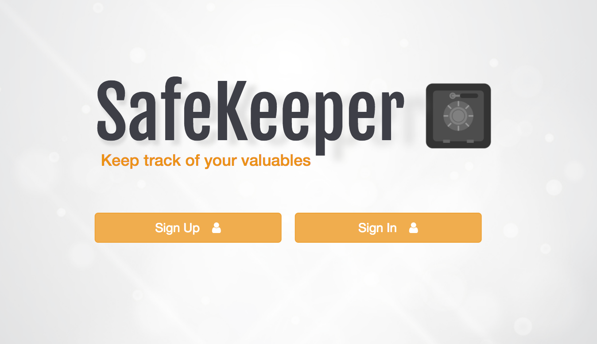
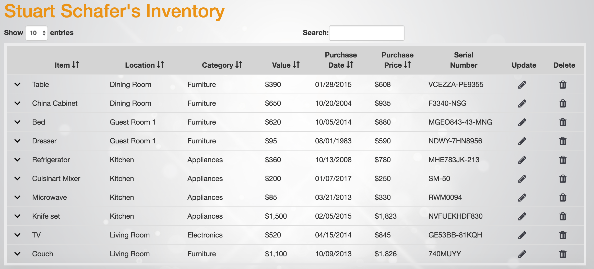
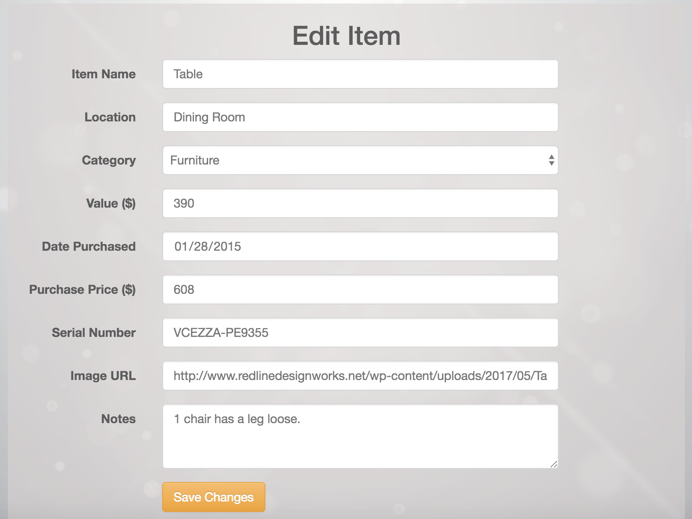
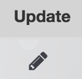
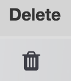

# SafeKeeper (Formerly known as Virtual-Locker) #:lock:

***A personal inventory for insurance, theft or relocation purposes.***

Please visit our application @ https://safe-stream-99507.herokuapp.com/

To interact with an example inventory, sign in using email: " stu@mail.com ", pw: 12345

## CONTENTS ##
[:movie_camera: Video demonstration](#video)

[:bust_in_silhouette: Sign in or Sign up](#signup)

[:clipboard: Inventory](#inventory)

[:pencil: Add, Update or Delete](#CUD)

[:man::woman::woman: Contributors](#contributors)

## Video Demonstration ##

[:file_folder: Back to Contents](#contents)

## USERS :bust_in_silhouette:
### SIGN UP ###

***It's easy to sign up for SafeKeeper and start adding items to your own personal inventory database.***

### SIGN IN ###

***You can sign in to see your existing inventory anytime.  Just use your e-mail and remember your password!***

[:file_folder: Back to Contents](#contents)

## INVENTORY :clipboard:

***Your inventory contains all necessary information for insurance or relocation purposes.  You can sort your inventory table by item, location, category, value or date purchased.  You can also search your inventory to find specific items.  Your items will be securely saved in a database so your data will always be available unless you delete it.***

[:file_folder: Back to Contents](#contents)

## ADD, UPDATE OR DELETE :pencil:

### ADD ###

***You can easily add items to your inventory.  You just need an item name, a location and a category.  You can also add the current value, the date purchased, the purchase price, the serial number, notes and an image if you wish.***

### UPDATE ###

***Any item can also easily be updated at any time.  You can add more information at a later date if the location of an item changes or the value goes up.***

### DELETE ###

***You can easily delete any item if it gets broken, lost or donated.***

[:file_folder: Back to Contents](#contents)

---

## Contributors

- [@stuartschafer](https://github.com/stuartschafer) :fireworks:
- [@indiaaeevans](https://github.com/indiaaeevans) :v:
- [@mamorvan](https://www.github.com/mamorvan) :koala:

[:file_folder: Back to Contents](#contents)